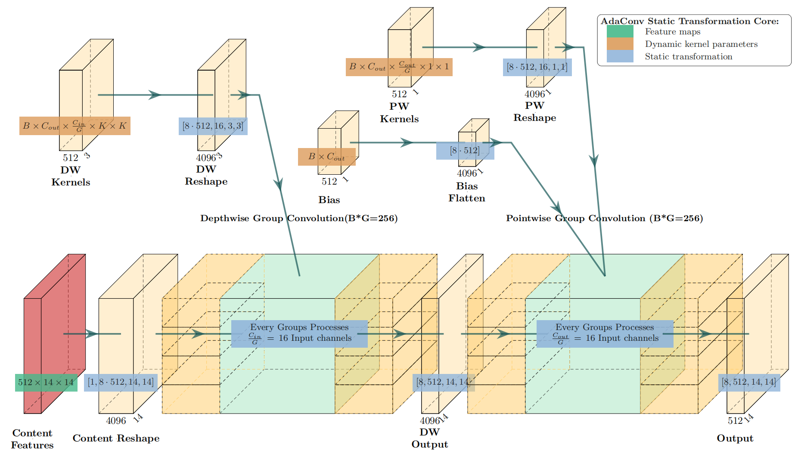
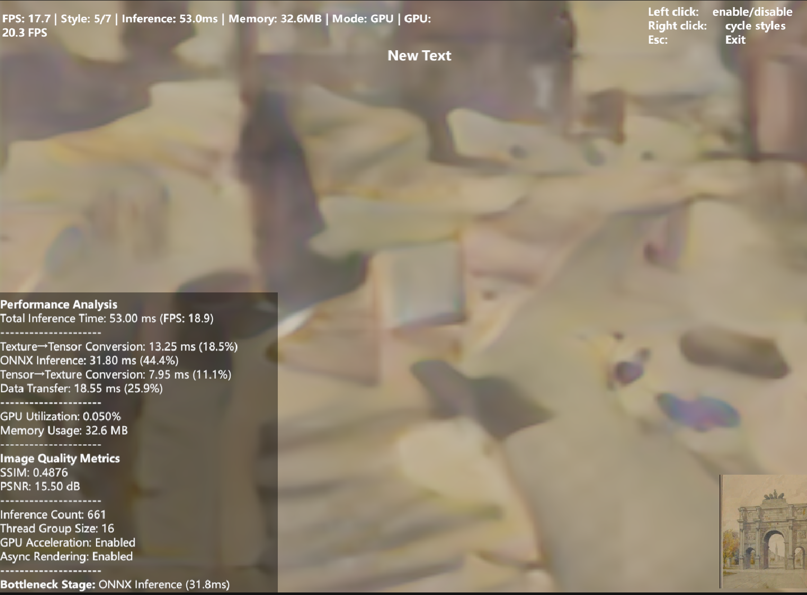

# StructAdapt: AdaConv Static Conversion for Unity

**StructAdapt** is the companion open-source project to the paper  
[*AdaConv: Structure-Aware Real-Time Style Transfer Algorithm and Its Rendering Implementation in Unity Engine*](https://doi.org/10.2991/978-94-6463-823-3_100).

This repository provides the engineering implementation of the method described in the paper — exporting the **AdaConv** style-transfer algorithm to the **ONNX** format and deploying it inside the **Unity Engine**.  
It addresses the structural incompatibility between AdaConv’s dynamic kernel generation and static-graph inference frameworks by introducing a **grouped-convolution vectorization** strategy.

Three exportable model variants are derived from the same AdaConv checkpoint:

- **Fully Dynamic Model** – preserves both spatial and batch dimension dynamics.  
- **Batch-Dynamic Model** – fixes spatial dimensions while keeping batch dynamics.  
- **Static Model** – adopts a completely static computation graph.

All variants achieve real-time rendering of approximately 14.5 FPS on RTX 4060, and SSIM ≈ 0.67–0.68, demonstrating structural equivalence to the original AdaConv formulation.

For detailed methodology and experiments, please refer to the [published paper](https://doi.org/10.2991/978-94-6463-823-3_100).

---

## Theoretical core


---

## Environment Setup

### Python Environment
This project requires Python ≥3.10.  
All dependencies are listed in `StyleAdapt-Core/config/requirements.txt`.

```bash
cd StyleAdapt-Core/config
pip install -r requirements.txt
```

Key libraries include:
- torch, onnx, onnxruntime-gpu
- tensorboard, PyYAML, scikit-image
- matplotlib, tqdm

### CUDA and cuDNN Configuration

The project was developed and verified under the following environment:

```markdown
nvcc: NVIDIA (R) Cuda compiler driver
Build cuda_12.9.r12.9/compiler.35813241_0
Cuda compilation tools, release 12.9, V12.9.41

NVIDIA-SMI 581.29
Driver Version: 581.29
CUDA Version: 13.0
GPU: NVIDIA GeForce RTX 4060 Laptop GPU
Compute Mode: Default
VRAM: 8 GB

cuDNN Version: 9.10.2
Supported SM Architectures: up to 12.0
```
Ensure your CUDA and cuDNN versions are consistent with these configurations to achieve optimal performance.

### Unity Environment
- Unity 2022.3.55f1c1
- NuGet Version:4.4.0
- Microsoft.ML.OnnxRuntime.Managed Version:1.20.0
- Platform: Windows 11 + RTX GPU (CUDA 12.9 / 13.0)

---

## How to Run

### Training
```bash
python train.py -c ./configs/lambda100.yaml -d ./data/raw -l ./logs
```

### Fine-tuning
```bash
python train.py -c ./configs/lambda100.yaml -d ./data/finetune --finetune
```

### Visualization
```bash
tensorboard --logdir=./logs/tensorboard
python visualizer.py
```

### ONNX Export
Export different structural variants from the same AdaConv checkpoint:

```bash
python exporter.py --output model.onnx
python exporter.py --output model_static.onnx --static
python exporter.py --output model_dyn.onnx --dynamic
python exporter.py --output model_batch.onnx --dynamic-batch
```

---

## Model Configuration

All hyperparameters are defined in `config/lambda100.yaml`, including:
- Convolution kernel layout and dynamic mapping rules  
- Loss coefficients (lambda_content, lambda_style, etc.)  
- Dataset paths and normalization pipeline  
- Training and inference batch parameters

You can duplicate and modify this YAML file to customize different training schemes.

---

## Citation

If you find this repository useful in your research or projects, please cite:

```
@inproceedings{He2025,
  title={AdaConv: Structure-Aware Real-Time Style Transfer Algorithm and Its Rendering Implementation in Unity Engine},
  author={Bin He},
  booktitle={Proceedings of the 2025 3rd International Conference on Image, Algorithms, and Artificial Intelligence (ICIAAI 2025)},
  pages={1029--1042},
  year={2025},
  publisher={Atlantis Press},
  doi={10.2991/978-94-6463-823-3_100},
  url={https://doi.org/10.2991/978-94-6463-823-3_100},
  issn={2352-538X}
}
```

---

## License
This project is released under the MIT License.  
See [LICENSE](./LICENSE) for details.

---

## Preview

---
## Notes
- To reproduce the paper’s performance, ensure CUDA and cuDNN versions match those listed above.  
- ONNX export supports both static and dynamic kernel graphs; static mode is recommended for Unity runtime integration.  
- The project is optimized for RTX 4060 series GPUs but remains portable to other Ampere and Ada Lovelace architectures.
